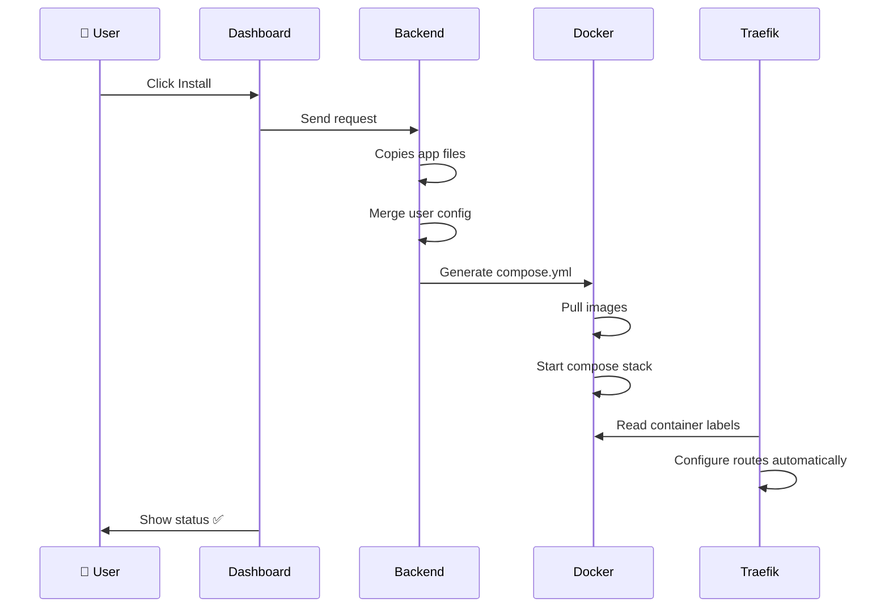
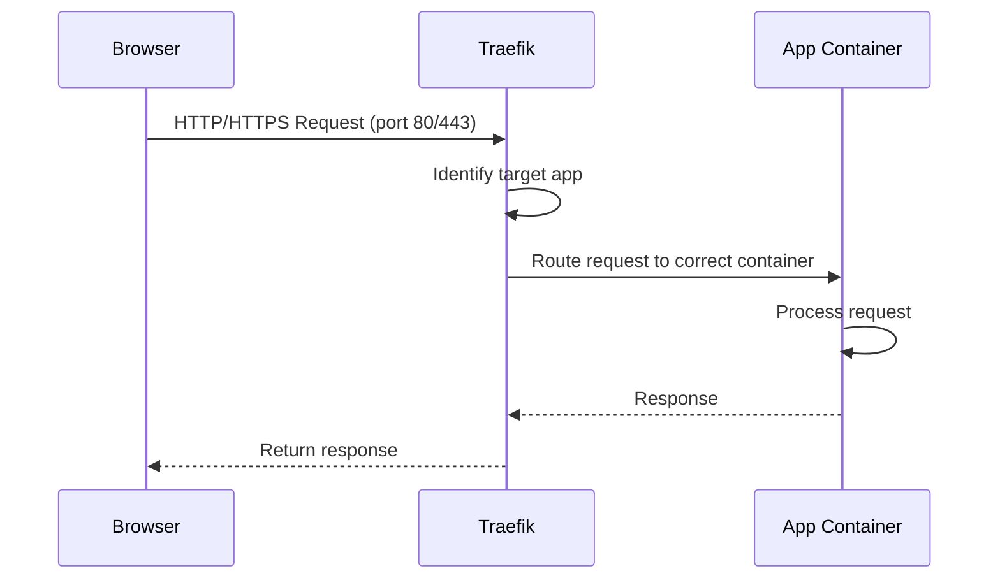

import { Callout } from "nextra/components";

# How Runtipi works

Understanding how Runtipi works will help you make the most of it and troubleshoot issues when they arise.

## The big picture

Runtipi is a layer on top of Docker that simplifies self-hosting. Think of it as the "App Store" experience for your server but instead of apps running on your phone, they run in isolated containers on your server.

```
┌─────────────────────────────────────────┐
│         Your Web Browser                │
└─────────────┬───────────────────────────┘
              │ Access via HTTP/HTTPS
┌─────────────▼───────────────────────────┐
│     Runtipi Dashboard (Web UI)          │
│  (Shows apps, manages installations)    │
└─────────────┬───────────────────────────┘
              │ Controls
┌─────────────▼───────────────────────────┐
│      Runtipi Backend & CLI              │
│  (Processes requests, manages Docker)   │
└─────────────┬───────────────────────────┘
              │ Commands
┌─────────────▼───────────────────────────┐
│          Docker Engine                  │
│  (Runs containers, manages networking)  │
└─────────────┬───────────────────────────┘
              │ Runs
┌─────────────▼───────────────────────────┐
│      Your Apps (Containers)             │
│   Nextcloud | File Browser | etc.       │
└─────────────────────────────────────────┘
```

## Key components

### 1. Runtipi dashboard
The web interface you interact with. It's a React application that runs in a Docker container and communicates with the backend to:
- Display available apps
- Show app status (running, stopped, installing)
- Let you configure app settings
- Manage system settings

### 2. Runtipi CLI
A command-line tool (`runtipi-cli`) for administrative tasks:
- Starting/stopping Runtipi
- Updating to newer versions
- Managing backups
- Viewing logs
- Debugging issues

### 3. App Store
A repository (separate from Runtipi itself) containing app definitions. Each app has:
- `config.json`: Metadata, requirements, and exposed settings
- `docker-compose.json`: Container configuration
- Additional files: logos, descriptions, documentation

### 4. Traefik (reverse proxy)
Handles all incoming web traffic and routes it to the right app. It also:
- Generates SSL certificates automatically
- Handles domain routing
- Manages internal networking between containers

### 5. PostgreSQL database
Stores Runtipi's configuration:
- User accounts
- App installations and settings
- System configuration
- App states

## How app installation works

When you click "Install" on an app, here's what happens:

1. **Download**: Runtipi downloads the app definition from the App Store repository and stores it on your server
2. **Configuration**: Your settings are merged with the app's default configuration
3. **Compose Generation**: A Docker Compose file is generated with your specific settings
4. **Container Pull**: Docker downloads the app's container image(s)
5. **Start**: The app container starts running
6. **Network Setup**: Traefik reads the labels set in the compose file and configures routing
7. **Health Check**: Runtipi monitors the app to ensure it started successfully

## Data flow

### Installing an App



### Accessing an app




## File Structure

Runtipi stores everything in its installation directory (typically where you ran the install script):

```
runtipi/
├── runtipi-cli           # CLI executable
├── app-data/             # App data (your files, databases, etc.)
│   ├── nextcloud/
│   ├── filebrowser/
│   └── ...
├── apps/                 # App definitions and generated compose files
├── state/                # Runtipi's internal state
├── traefik/              # Reverse proxy configuration
├── user-config/          # Your custom configurations
└── docker-compose.yml    # Main Runtipi services
```

<Callout type="info">
  **Important**: The `app-data` directory contains all your app data. Back this up regularly!
</Callout>

## What makes Runtipi different?

- **No manual networking**: Traefik handles all routing automatically
- **No YAML editing**: Configuration through web UI. Customizations are possible but not required
- **Easy management**: Start/stop apps with a click even from mobile
- **Automatic updates**: Apps can be updated with minimal effort
- **App ecosystem**: Curated apps that work out of the box
- **Beginner-friendly**: Abstracts docker and networking complexity

<Callout>
  Runtipi doesn't lock you in. All apps are standard Docker containers. You can export the compose files and run them independently if needed. All the generated files are stored in the `apps/` directory.
</Callout>
