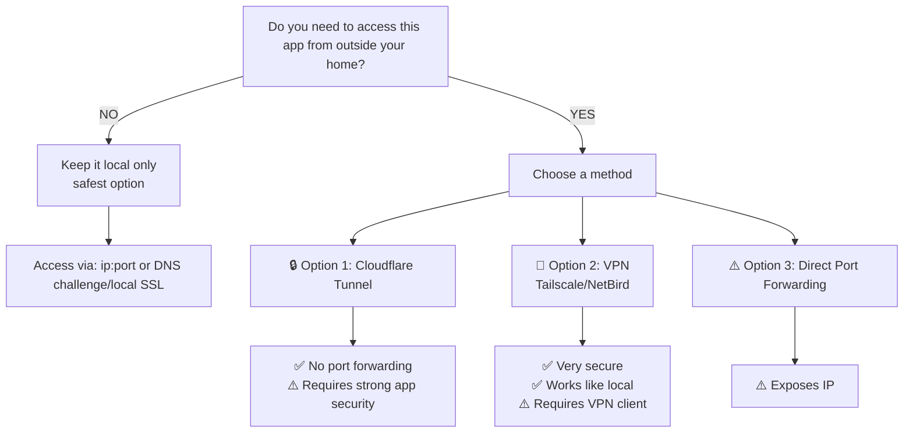

import { Callout, Tabs } from "nextra/components";

# Reverse proxy explained

A reverse proxy is a server that sits between you and your apps. It routes incoming requests to the correct app based on the URL.
This allows you to run multiple apps on the same server using standard web ports (80 for HTTP, 443 for HTTPS) without requiring separate ports for each app.

### Without a reverse proxy

Each app needs its own port:
```
Nextcloud      → http://192.168.1.100:8080
File Browser   → http://192.168.1.100:8081
Jellyfin       → http://192.168.1.100:8096
...
```

**Problems:**
- Hard to remember URLs
- No HTTPS (traffic not encrypted)
- Port conflicts

### With a reverse proxy

All traffic goes through port **80** (HTTP) or **443** (HTTPS):
```
http://nextcloud.local → Traefik → Nextcloud container
http://files.local     → Traefik → File Browser container
http://jellyfin.local  → Traefik → Jellyfin container
```

**Benefits:**
- Easy-to-remember URLs
- Automatic HTTPS/SSL certificates
- One port to manage
- Apps don't conflict

## What is SSL/HTTPS?

SSL encrypts the connection between your browser and the server. You want this for:

- **Security**: Data can't be intercepted (passwords, personal files, etc.)
- **Privacy**: Nobody can see what data you're sending/receiving

### HTTP vs HTTPS

<Tabs items={['HTTP (Insecure)', 'HTTPS (Secure)']}>
  <Tabs.Tab>
    ```
    http://myserver.com
    ```
    - ❌ Data sent in plain text
    - ❌ Passwords visible to network snoopers
    - ❌ Browser shows "Not Secure" warning
    - ✅ Easy to set up
    - ✅ Fine for local network only
  </Tabs.Tab>
  <Tabs.Tab>
    ```
    https://myserver.com
    ```
    - ✅ Data encrypted end-to-end
    - ✅ Passwords protected
    - ✅ Browser shows green padlock
    - ⚠️ Requires SSL certificate
    - ✅ Required for internet exposure
  </Tabs.Tab>
</Tabs>

## Domain names vs IP addresses

In order to set your homeserver up for this, there is a little upfront configuration needed to get your DNS and SSL certificates working properly.
For this, you have two main options:

- Using a domain name you own and setup a [DNS challenge](/docs/guides/dns-challenge-cloudflare) to get free SSL certificates from Let's Encrypt.
- Use the [local SSL certificate](/docs/guides/local-certificate) that is generated for you. This requires you to add a custom CA to all your devices.

<Callout emoji="💡">
  Using a domain doesn't mean your server is exposed to the internet. You can use a domain name for local network access only. With the two options above, all traffic remains within your local network.
</Callout>

## Exposing apps to the internet

Exposing your apps to the internet means making them accessible from outside your home network. This can be useful for:

- Accessing your files from work or on vacation
- Sharing media with friends and family
- Running a personal website or blog

### Making the decision: should I expose my app?



Guides:
- [Expose with Cloudflare tunnels](/docs/guides/expose-apps-with-cloudflare-tunnels)
- [Expose your apps (port forwarding)](/docs/guides/expose-your-apps)

## Exposure scenarios

### Scenario 1: Family media server
**Need:** Access movies/music from any device at home

**Solution:** Local network access
- No additional setup needed
- Access via `http://server-ip:port`
- Secure and fast

### Scenario 2: Personal cloud storage
**Need:** Access files from work, vacation, anywhere

**Solution:** Cloudflare Tunnel or VPN
- Secure, encrypted access from anywhere
- No exposed ports
- Guide: [Expose with Cloudflare tunnels](/docs/guides/expose-apps-with-cloudflare-tunnels)

### Scenario 3: Online blog
**Need:** Share blog with public internet

**Solution:** Cloudflare tunnel OR Direct exposure with strong security
- Use a domain name
- Enable HTTPS with SSL certificates
- Regularly update and monitor for security

